### A. Use Case Diagram

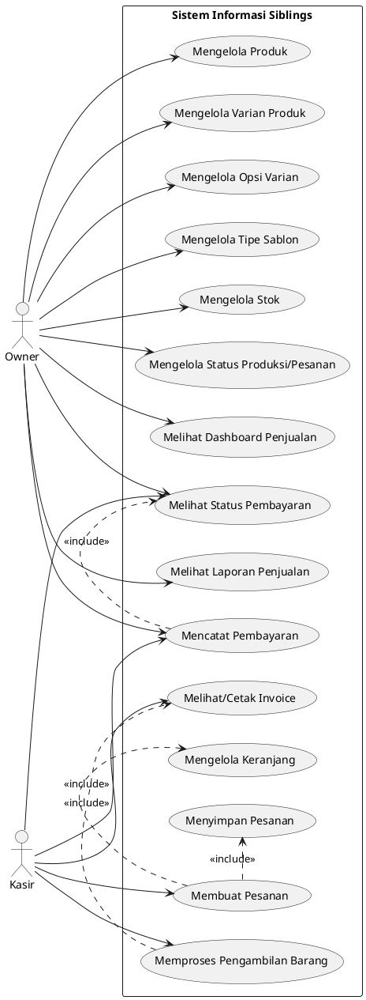
```plantuml
@startuml
left to right direction
skinparam packageStyle rectangle

actor Owner
actor Kasir

rectangle "Sistem Informasi Siblings" {
  usecase "Mengelola Produk" as UC1
  usecase "Mengelola Varian Produk" as UC2
  usecase "Mengelola Opsi Varian" as UC3
  usecase "Mengelola Tipe Sablon" as UC4
  usecase "Mengelola Stok" as UC5
  usecase "Mengelola Status Produksi/Pesanan" as UC6
  usecase "Melihat Dashboard Penjualan" as UC7
  usecase "Melihat Laporan Penjualan" as UC8

  usecase "Membuat Pesanan" as UC9
  usecase "Mengelola Keranjang" as UC10
  usecase "Menyimpan Pesanan" as UC12
  usecase "Mencatat Pembayaran" as UC13
  usecase "Melihat Status Pembayaran" as UC14
  usecase "Melihat/Cetak Invoice" as UC15
  usecase "Memproses Pengambilan Barang" as UC16
}

Owner --> UC1
Owner --> UC2
Owner --> UC3
Owner --> UC4
Owner --> UC5
Owner --> UC6
Owner --> UC7
Owner --> UC8
Owner --> UC13
Owner --> UC14

Kasir --> UC9
Kasir --> UC13
Kasir --> UC14
Kasir --> UC15
Kasir --> UC16

UC9 .> UC10 : <<include>>
UC9 .> UC12 : <<include>>
UC13 .> UC14 : <<include>>
UC16 .> UC15 : <<include>>
@enduml
```

### B. Activity Diagram Use Case Mengelola Produk

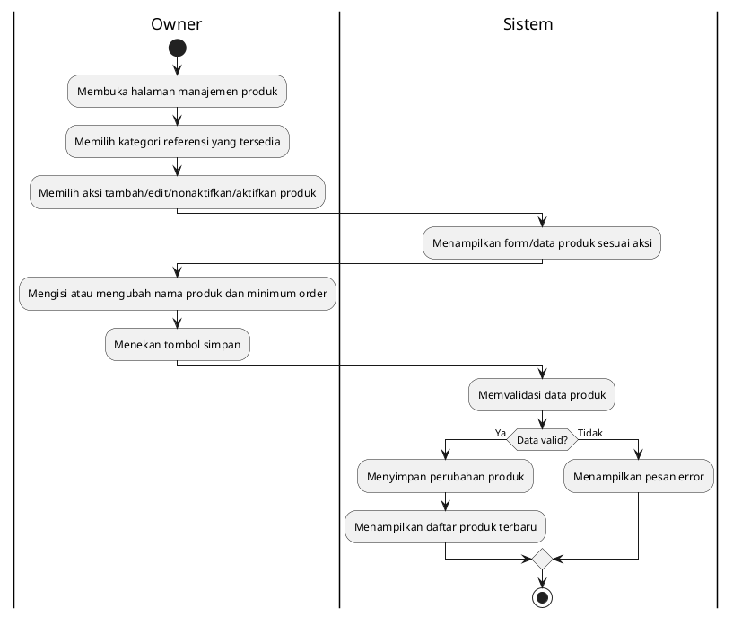
```plantuml
@startuml
|Owner|
start
:Membuka halaman manajemen produk;
:Memilih kategori referensi yang tersedia;
:Memilih aksi tambah/edit/nonaktifkan/aktifkan produk;

|Sistem|
:Menampilkan form/data produk sesuai aksi;

|Owner|
:Mengisi atau mengubah nama produk dan minimum order;
:Menekan tombol simpan;

|Sistem|
:Memvalidasi data produk;
if (Data valid?) then (Ya)
  :Menyimpan perubahan produk;
  :Menampilkan daftar produk terbaru;
else (Tidak)
  :Menampilkan pesan error;
endif
stop
@enduml
```

### C. Activity Diagram Use Case Mengelola Varian Produk

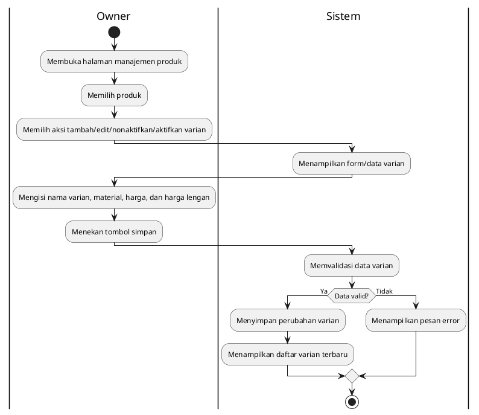
```plantuml
@startuml
|Owner|
start
:Membuka halaman manajemen produk;
:Memilih produk;
:Memilih aksi tambah/edit/nonaktifkan/aktifkan varian;

|Sistem|
:Menampilkan form/data varian;

|Owner|
:Mengisi nama varian, material, harga, dan harga lengan;
:Menekan tombol simpan;

|Sistem|
:Memvalidasi data varian;
if (Data valid?) then (Ya)
  :Menyimpan perubahan varian;
  :Menampilkan daftar varian terbaru;
else (Tidak)
  :Menampilkan pesan error;
endif
stop
@enduml
```

### D. Activity Diagram Use Case Mengelola Opsi Varian

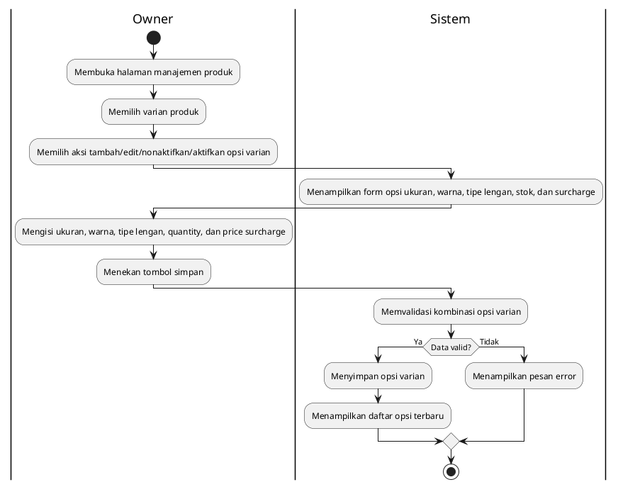
```plantuml
@startuml
|Owner|
start
:Membuka halaman manajemen produk;
:Memilih varian produk;
:Memilih aksi tambah/edit/nonaktifkan/aktifkan opsi varian;

|Sistem|
:Menampilkan form opsi ukuran, warna, tipe lengan, stok, dan surcharge;

|Owner|
:Mengisi ukuran, warna, tipe lengan, quantity, dan price surcharge;
:Menekan tombol simpan;

|Sistem|
:Memvalidasi kombinasi opsi varian;
if (Data valid?) then (Ya)
  :Menyimpan opsi varian;
  :Menampilkan daftar opsi terbaru;
else (Tidak)
  :Menampilkan pesan error;
endif
stop
@enduml
```

### E. Activity Diagram Use Case Mengelola Tipe Sablon

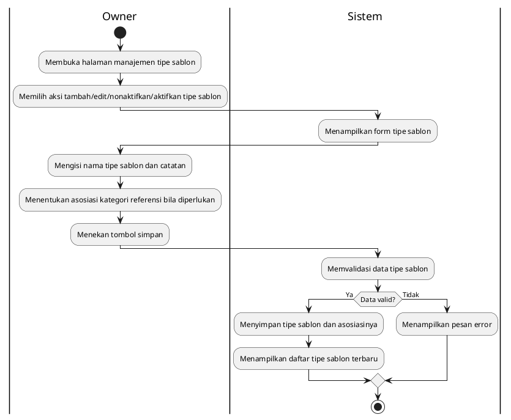
```plantuml
@startuml
|Owner|
start
:Membuka halaman manajemen tipe sablon;
:Memilih aksi tambah/edit/nonaktifkan/aktifkan tipe sablon;

|Sistem|
:Menampilkan form tipe sablon;

|Owner|
:Mengisi nama tipe sablon dan catatan;
:Menentukan asosiasi kategori referensi bila diperlukan;
:Menekan tombol simpan;

|Sistem|
:Memvalidasi data tipe sablon;
if (Data valid?) then (Ya)
  :Menyimpan tipe sablon dan asosiasinya;
  :Menampilkan daftar tipe sablon terbaru;
else (Tidak)
  :Menampilkan pesan error;
endif
stop
@enduml
```

### F. Activity Diagram Use Case Mengelola Stok

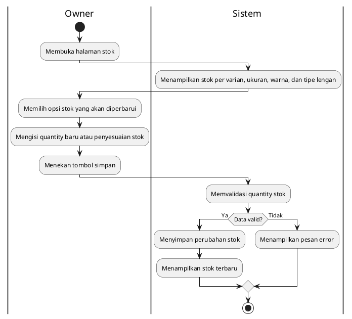
```plantuml
@startuml
|Owner|
start
:Membuka halaman stok;

|Sistem|
:Menampilkan stok per varian, ukuran, warna, dan tipe lengan;

|Owner|
:Memilih opsi stok yang akan diperbarui;
:Mengisi quantity baru atau penyesuaian stok;
:Menekan tombol simpan;

|Sistem|
:Memvalidasi quantity stok;
if (Data valid?) then (Ya)
  :Menyimpan perubahan stok;
  :Menampilkan stok terbaru;
else (Tidak)
  :Menampilkan pesan error;
endif
stop
@enduml
```

### G. Activity Diagram Use Case Membuat Pesanan

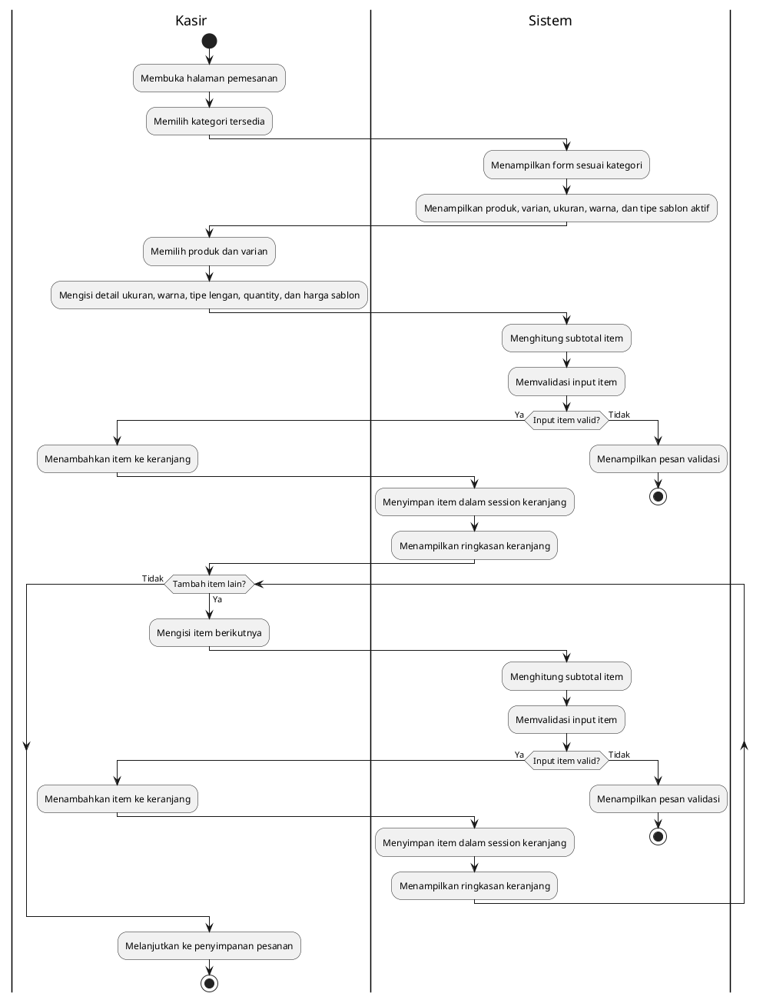
```plantuml
@startuml
|Kasir|
start
:Membuka halaman pemesanan;
:Memilih kategori tersedia;

|Sistem|
:Menampilkan form sesuai kategori;
:Menampilkan produk, varian, ukuran, warna, dan tipe sablon aktif;

|Kasir|
:Memilih produk dan varian;
:Mengisi detail ukuran, warna, tipe lengan, quantity, dan harga sablon;

|Sistem|
:Menghitung subtotal item;
:Memvalidasi input item;
if (Input item valid?) then (Ya)
  |Kasir|
  :Menambahkan item ke keranjang;
  |Sistem|
  :Menyimpan item dalam session keranjang;
  :Menampilkan ringkasan keranjang;
else (Tidak)
  :Menampilkan pesan validasi;
  stop
endif

|Kasir|
while (Tambah item lain?) is (Ya)
  :Mengisi item berikutnya;
  |Sistem|
  :Menghitung subtotal item;
  :Memvalidasi input item;
  if (Input item valid?) then (Ya)
    |Kasir|
    :Menambahkan item ke keranjang;
    |Sistem|
    :Menyimpan item dalam session keranjang;
    :Menampilkan ringkasan keranjang;
  else (Tidak)
    :Menampilkan pesan validasi;
    stop
  endif
  |Kasir|
endwhile (Tidak)
:Melanjutkan ke penyimpanan pesanan;
stop
@enduml
```

### H. Activity Diagram Use Case Menyimpan Pesanan

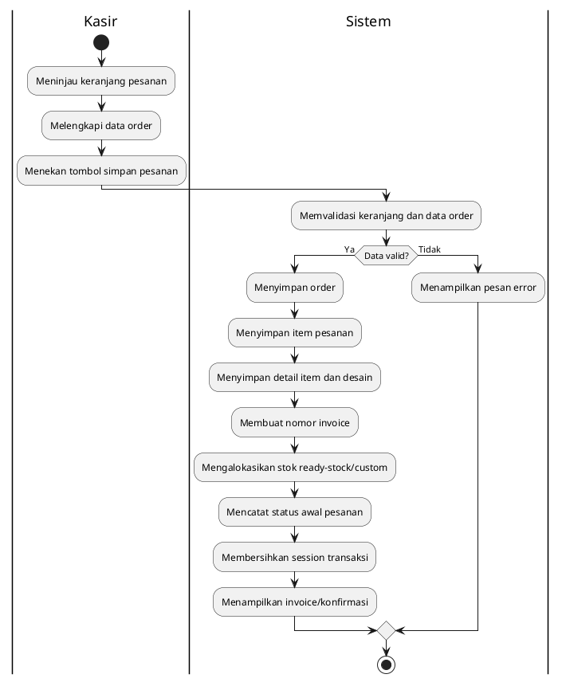
```plantuml
@startuml
|Kasir|
start
:Meninjau keranjang pesanan;
:Melengkapi data order;
:Menekan tombol simpan pesanan;

|Sistem|
:Memvalidasi keranjang dan data order;
if (Data valid?) then (Ya)
  :Menyimpan order;
  :Menyimpan item pesanan;
  :Menyimpan detail item dan desain;
  :Membuat nomor invoice;
  :Mengalokasikan stok ready-stock/custom;
  :Mencatat status awal pesanan;
  :Membersihkan session transaksi;
  :Menampilkan invoice/konfirmasi;
else (Tidak)
  :Menampilkan pesan error;
endif
stop
@enduml
```

### I. Activity Diagram Use Case Mencatat Pembayaran

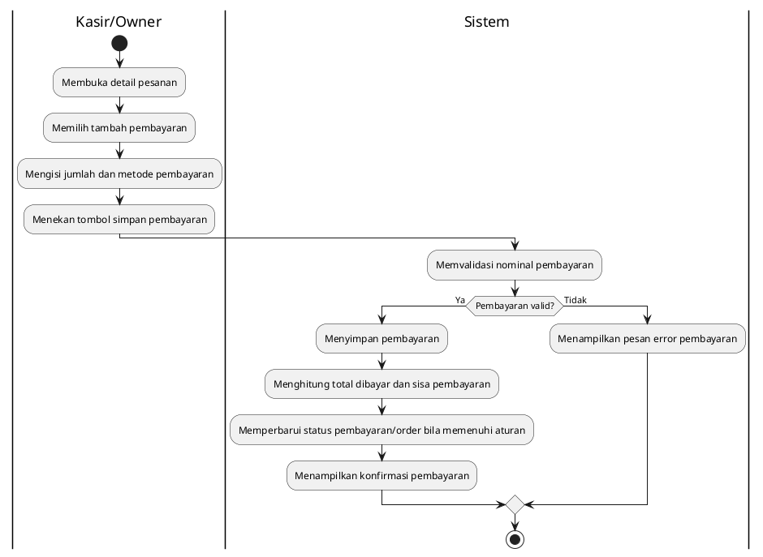
```plantuml
@startuml
|Kasir/Owner|
start
:Membuka detail pesanan;
:Memilih tambah pembayaran;
:Mengisi jumlah dan metode pembayaran;
:Menekan tombol simpan pembayaran;

|Sistem|
:Memvalidasi nominal pembayaran;
if (Pembayaran valid?) then (Ya)
  :Menyimpan pembayaran;
  :Menghitung total dibayar dan sisa pembayaran;
  :Memperbarui status pembayaran/order bila memenuhi aturan;
  :Menampilkan konfirmasi pembayaran;
else (Tidak)
  :Menampilkan pesan error pembayaran;
endif
stop
@enduml
```

### J. Activity Diagram Use Case Melihat/Cetak Invoice

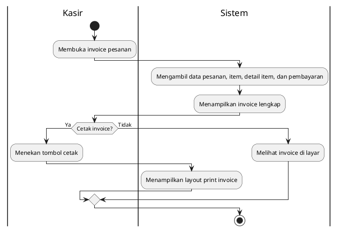
```plantuml
@startuml
|Kasir|
start
:Membuka invoice pesanan;

|Sistem|
:Mengambil data pesanan, item, detail item, dan pembayaran;
:Menampilkan invoice lengkap;

|Kasir|
if (Cetak invoice?) then (Ya)
  :Menekan tombol cetak;
  |Sistem|
  :Menampilkan layout print invoice;
else (Tidak)
  :Melihat invoice di layar;
endif
stop
@enduml
```

### K. Activity Diagram Use Case Mengelola Status Produksi/Pesanan

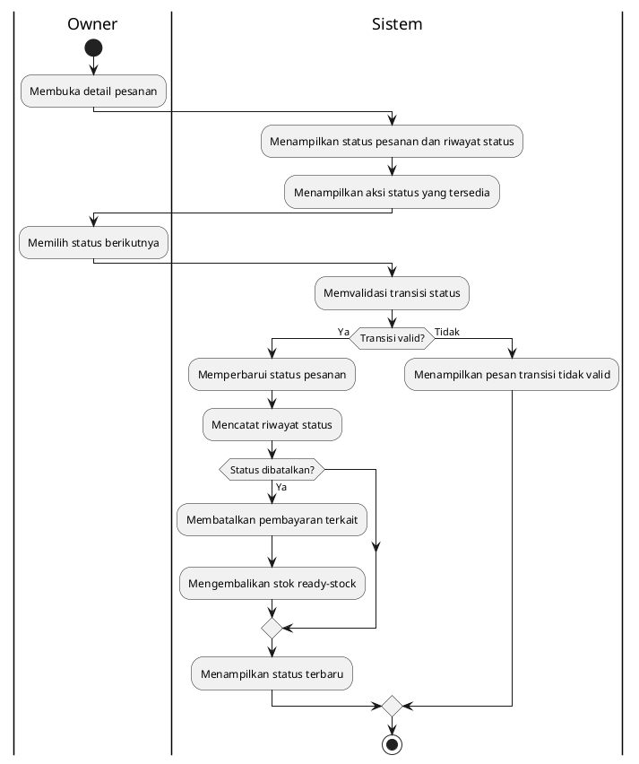
```plantuml
@startuml
|Owner|
start
:Membuka detail pesanan;

|Sistem|
:Menampilkan status pesanan dan riwayat status;
:Menampilkan aksi status yang tersedia;

|Owner|
:Memilih status berikutnya;

|Sistem|
:Memvalidasi transisi status;
if (Transisi valid?) then (Ya)
  :Memperbarui status pesanan;
  :Mencatat riwayat status;
  if (Status dibatalkan?) then (Ya)
    :Membatalkan pembayaran terkait;
    :Mengembalikan stok ready-stock;
  endif
  :Menampilkan status terbaru;
else (Tidak)
  :Menampilkan pesan transisi tidak valid;
endif
stop
@enduml
```

### L. Activity Diagram Use Case Memproses Pengambilan Barang

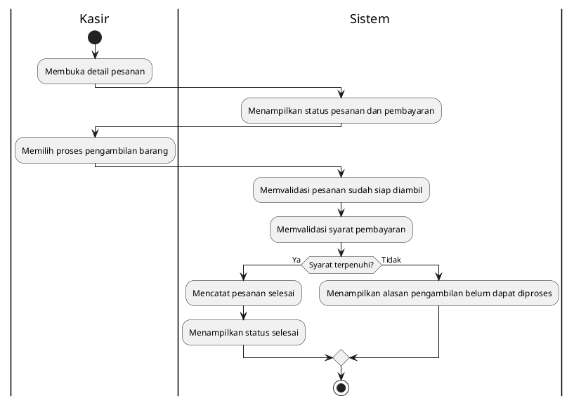
```plantuml
@startuml
|Kasir|
start
:Membuka detail pesanan;

|Sistem|
:Menampilkan status pesanan dan pembayaran;

|Kasir|
:Memilih proses pengambilan barang;

|Sistem|
:Memvalidasi pesanan sudah siap diambil;
:Memvalidasi syarat pembayaran;
if (Syarat terpenuhi?) then (Ya)
  :Mencatat pesanan selesai;
  :Menampilkan status selesai;
else (Tidak)
  :Menampilkan alasan pengambilan belum dapat diproses;
endif
stop
@enduml
```

### M. Activity Diagram — Use Case Melihat Dashboard/Laporan

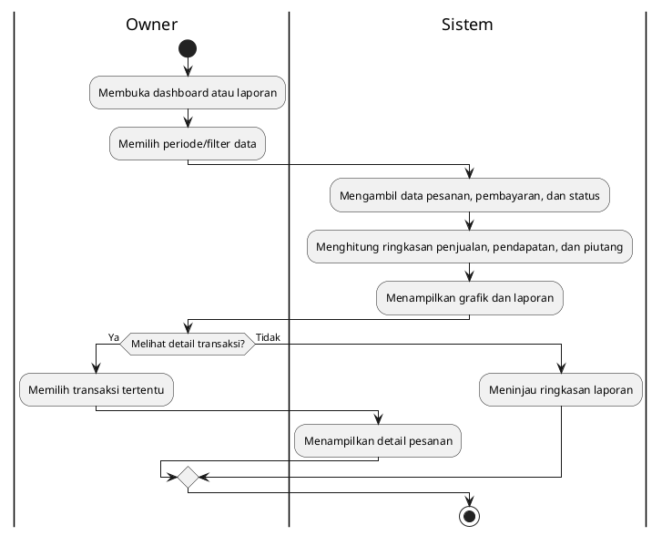
```plantuml
@startuml
|Owner|
start
:Membuka dashboard atau laporan;
:Memilih periode/filter data;

|Sistem|
:Mengambil data pesanan, pembayaran, dan status;
:Menghitung ringkasan penjualan, pendapatan, dan piutang;
:Menampilkan grafik dan laporan;

|Owner|
if (Melihat detail transaksi?) then (Ya)
  :Memilih transaksi tertentu;
  |Sistem|
  :Menampilkan detail pesanan;
else (Tidak)
  :Meninjau ringkasan laporan;
endif
stop
@enduml
```

### N. Sequence Diagram Simpan Pesanan

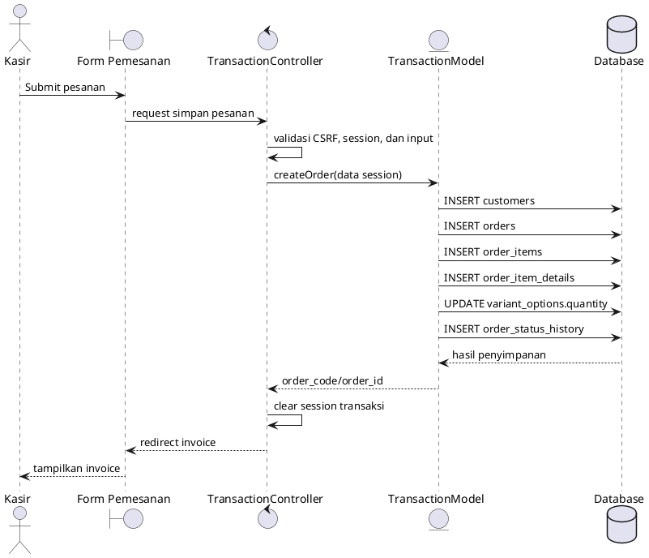
```plantuml
@startuml
actor Kasir
boundary "Form Pemesanan" as Boundary
control "TransactionController" as Control
entity "TransactionModel" as Entity
database "Database" as DB

Kasir -> Boundary : Submit pesanan
Boundary -> Control : request simpan pesanan
Control -> Control : validasi CSRF, session, dan input
Control -> Entity : createOrder(data session)
Entity -> DB : INSERT customers
Entity -> DB : INSERT orders
Entity -> DB : INSERT order_items
Entity -> DB : INSERT order_item_details
Entity -> DB : UPDATE variant_options.quantity
Entity -> DB : INSERT order_status_history
DB --> Entity : hasil penyimpanan
Entity --> Control : order_code/order_id
Control -> Control : clear session transaksi
Control --> Boundary : redirect invoice
Boundary --> Kasir : tampilkan invoice
@enduml
```

### O. Sequence Diagram Catat Pembayaran

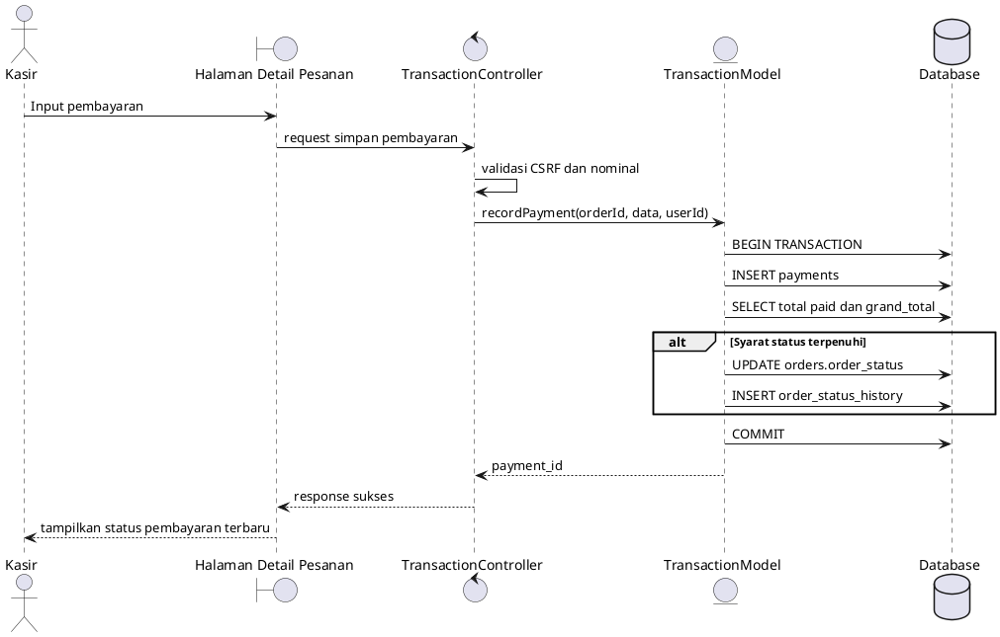
```plantuml
@startuml
actor Kasir
boundary "Halaman Detail Pesanan" as Boundary
control "TransactionController" as Control
entity "TransactionModel" as Entity
database "Database" as DB

Kasir -> Boundary : Input pembayaran
Boundary -> Control : request simpan pembayaran
Control -> Control : validasi CSRF dan nominal
Control -> Entity : recordPayment(orderId, data, userId)
Entity -> DB : BEGIN TRANSACTION
Entity -> DB : INSERT payments
Entity -> DB : SELECT total paid dan grand_total
alt Syarat status terpenuhi
  Entity -> DB : UPDATE orders.order_status
  Entity -> DB : INSERT order_status_history
end
Entity -> DB : COMMIT
Entity --> Control : payment_id
Control --> Boundary : response sukses
Boundary --> Kasir : tampilkan status pembayaran terbaru
@enduml
```

### P. Sequence Diagram Update Status Produksi/Pesanan

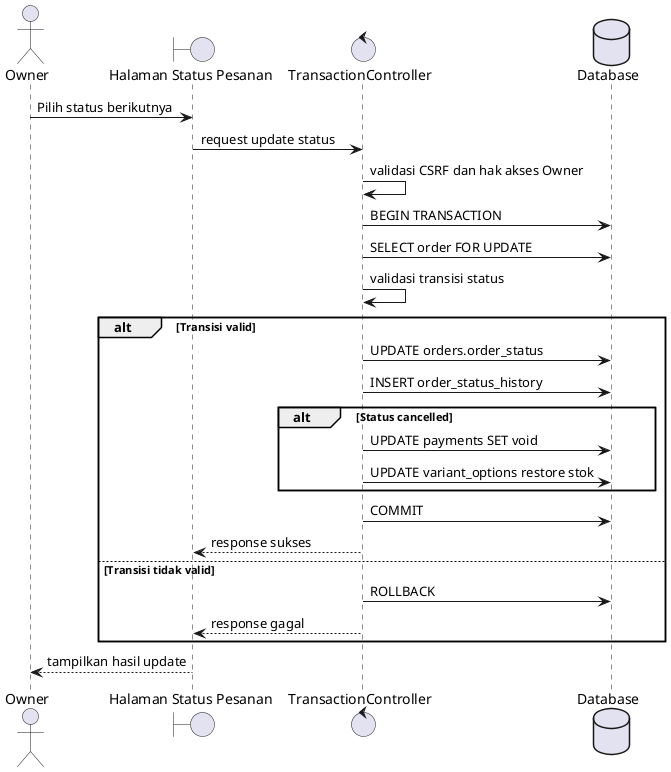
```plantuml
@startuml
actor Owner
boundary "Halaman Status Pesanan" as Boundary
control "TransactionController" as Control
database "Database" as DB

Owner -> Boundary : Pilih status berikutnya
Boundary -> Control : request update status
Control -> Control : validasi CSRF dan hak akses Owner
Control -> DB : BEGIN TRANSACTION
Control -> DB : SELECT order FOR UPDATE
Control -> Control : validasi transisi status
alt Transisi valid
  Control -> DB : UPDATE orders.order_status
  Control -> DB : INSERT order_status_history
  alt Status cancelled
    Control -> DB : UPDATE payments SET void
    Control -> DB : UPDATE variant_options restore stok
  end
  Control -> DB : COMMIT
  Control --> Boundary : response sukses
else Transisi tidak valid
  Control -> DB : ROLLBACK
  Control --> Boundary : response gagal
end
Boundary --> Owner : tampilkan hasil update
@enduml
```

### Q. Domain Class Diagram

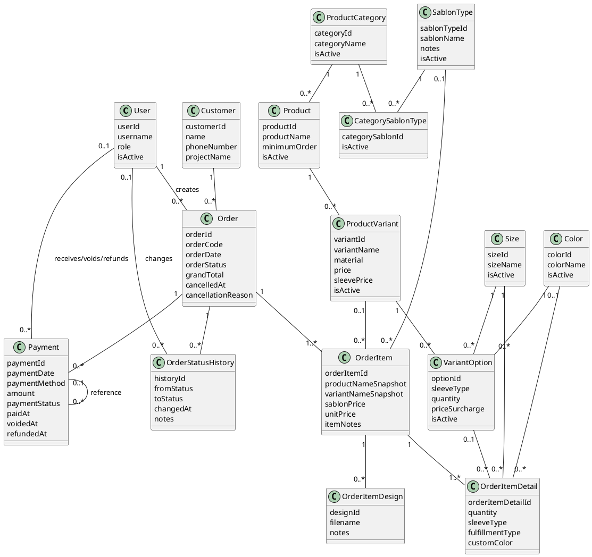
```plantuml
@startuml
class User {
  userId
  username
  role
  isActive
}

class ProductCategory {
  categoryId
  categoryName
  isActive
}

class Product {
  productId
  productName
  minimumOrder
  isActive
}

class ProductVariant {
  variantId
  variantName
  material
  price
  sleevePrice
  isActive
}

class VariantOption {
  optionId
  sleeveType
  quantity
  priceSurcharge
  isActive
}

class Size {
  sizeId
  sizeName
  isActive
}

class Color {
  colorId
  colorName
  isActive
}

class SablonType {
  sablonTypeId
  sablonName
  notes
  isActive
}

class CategorySablonType {
  categorySablonId
  isActive
}

class Customer {
  customerId
  name
  phoneNumber
  projectName
}

class Order {
  orderId
  orderCode
  orderDate
  orderStatus
  grandTotal
  cancelledAt
  cancellationReason
}

class OrderItem {
  orderItemId
  productNameSnapshot
  variantNameSnapshot
  sablonPrice
  unitPrice
  itemNotes
}

class OrderItemDetail {
  orderItemDetailId
  quantity
  sleeveType
  fulfillmentType
  customColor
}

class OrderItemDesign {
  designId
  filename
  notes
}

class Payment {
  paymentId
  paymentDate
  paymentMethod
  amount
  paymentStatus
  paidAt
  voidedAt
  refundedAt
}

class OrderStatusHistory {
  historyId
  fromStatus
  toStatus
  changedAt
  notes
}

ProductCategory "1" -- "0..*" Product
Product "1" -- "0..*" ProductVariant
ProductVariant "1" -- "0..*" VariantOption
Size "1" -- "0..*" VariantOption
Color "1" -- "0..*" VariantOption
ProductCategory "1" -- "0..*" CategorySablonType
SablonType "1" -- "0..*" CategorySablonType
Customer "1" -- "0..*" Order
User "1" -- "0..*" Order : creates
Order "1" -- "1..*" OrderItem
ProductVariant "0..1" -- "0..*" OrderItem
SablonType "0..1" -- "0..*" OrderItem
OrderItem "1" -- "1..*" OrderItemDetail
VariantOption "0..1" -- "0..*" OrderItemDetail
Size "1" -- "0..*" OrderItemDetail
Color "0..1" -- "0..*" OrderItemDetail
OrderItem "1" -- "0..*" OrderItemDesign
Order "1" -- "0..*" Payment
Order "1" -- "0..*" OrderStatusHistory
User "0..1" -- "0..*" Payment : receives/voids/refunds
User "0..1" -- "0..*" OrderStatusHistory : changes
Payment "0..1" -- "0..*" Payment : reference
@enduml
```

### R. ERD

```mermaid
erDiagram
    users ||--o{ orders : creates
    users ||--o{ payments : receives_voids_refunds
    users ||--o{ order_status_history : changes
    users ||--o{ audit_log : writes

    product_categories ||--o{ products : has
    products ||--o{ product_variants : has
    product_variants ||--o{ variant_options : has
    sizes ||--o{ variant_options : defines
    colors ||--o{ variant_options : defines
    product_categories ||--o{ category_sablon_types : maps
    sablon_types ||--o{ category_sablon_types : maps

    customers ||--o{ orders : linked_to
    orders ||--o{ order_items : contains
    product_variants ||--o{ order_items : selected_variant
    sablon_types ||--o{ order_items : selected_sablon
    order_items ||--o{ order_item_details : has_details
    variant_options ||--o{ order_item_details : allocated_option
    sizes ||--o{ order_item_details : selected_size
    colors ||--o{ order_item_details : selected_color
    order_items ||--o{ order_item_designs : has_designs
    orders ||--o{ payments : has_payments
    payments ||--o{ payments : references
    orders ||--o{ order_status_history : has_history

    users {
        int user_id PK
        varchar username
        varchar password_hash
        enum role
        tinyint is_active
    }
    product_categories {
        int category_id PK
        varchar category_name
        tinyint is_active
    }
    products {
        int product_id PK
        int category_id FK
        varchar product_name
        int minimum_order
        tinyint is_active
    }
    product_variants {
        int variant_id PK
        int product_id FK
        varchar variant_name
        varchar material
        decimal price
        decimal sleeve_price
        tinyint is_active
    }
    variant_options {
        int option_id PK
        int variant_id FK
        int size_id FK
        int color_id FK
        enum sleeve_type
        int quantity
        decimal price_surcharge
        tinyint is_active
    }
    sizes {
        int size_id PK
        varchar size_name
        tinyint is_active
    }
    colors {
        int color_id PK
        varchar color_name
        tinyint is_active
    }
    sablon_types {
        int sablon_type_id PK
        varchar sablon_name
        text notes
        tinyint is_active
    }
    category_sablon_types {
        int category_sablon_id PK
        int category_id FK
        int sablon_type_id FK
        tinyint is_active
    }
    customers {
        int customer_id PK
        varchar name
        varchar phone_number
        varchar project_name
    }
    orders {
        int order_id PK
        varchar order_code
        int customer_id FK
        datetime order_date
        enum order_status
        decimal grand_total
        int user_id FK
        datetime cancelled_at
        text cancellation_reason
        int cancelled_by_user_id FK
    }
    order_items {
        int order_item_id PK
        int order_id FK
        int variant_id FK
        varchar product_name_snapshot
        varchar variant_name_snapshot
        int sablon_type_id FK
        decimal sablon_price
        decimal unit_price
        text item_notes
    }
    order_item_details {
        int order_item_detail_id PK
        int order_item_id FK
        int option_id FK
        int size_id FK
        int color_id FK
        int quantity
        enum sleeve_type
        enum fulfillment_type
        varchar custom_color
    }
    order_item_designs {
        int design_id PK
        int order_item_id FK
        varchar filename
        varchar notes
    }
    payments {
        int payment_id PK
        int order_id FK
        datetime payment_date
        enum payment_method
        decimal amount
        enum payment_status
        int received_by_user_id FK
        int voided_by_user_id FK
        int refunded_by_user_id FK
        datetime paid_at
        datetime voided_at
        datetime refunded_at
        int reference_payment_id FK
    }
    order_status_history {
        int history_id PK
        int order_id FK
        varchar from_status
        varchar to_status
        int changed_by_user_id FK
        datetime changed_at
        text notes
    }
    audit_log {
        bigint log_id PK
        varchar table_name
        int record_id
        enum action
        json old_values
        json new_values
        int user_id FK
        varchar ip_address
    }
```

### S. DFD Level 0

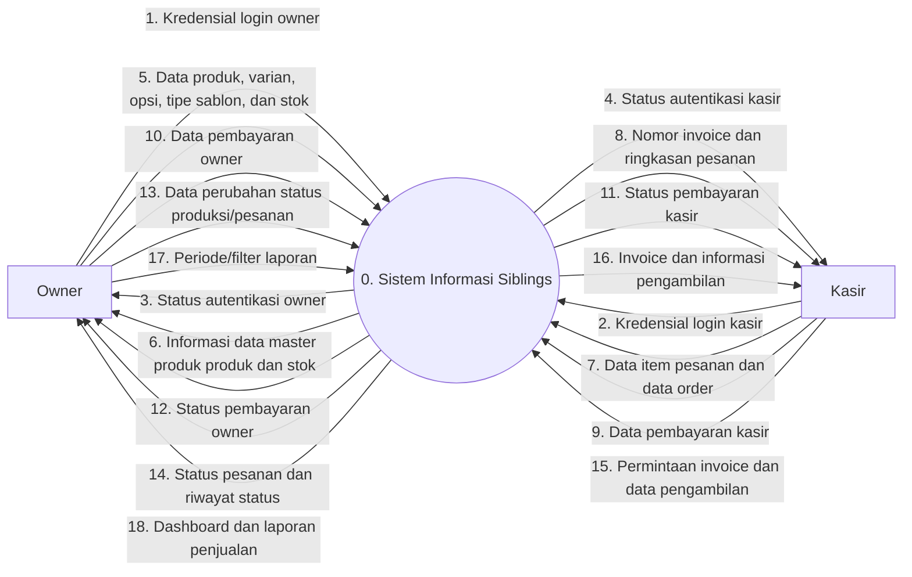
```mermaid
flowchart LR
    Owner[Owner]
    Kasir[Kasir]
    S((0. Sistem Informasi Siblings))

    Owner -->|1. Kredensial login owner| S
    Kasir -->|2. Kredensial login kasir| S
    S -->|3. Status autentikasi owner| Owner
    S -->|4. Status autentikasi kasir| Kasir

    Owner -->|5. Data produk, varian, opsi, tipe sablon, dan stok| S
    S -->|6. Informasi data master produk produk dan stok| Owner

    Kasir -->|7. Data item pesanan dan data order| S
    S -->|8. Nomor invoice dan ringkasan pesanan| Kasir

    Kasir -->|9. Data pembayaran kasir| S
    Owner -->|10. Data pembayaran owner| S
    S -->|11. Status pembayaran kasir| Kasir
    S -->|12. Status pembayaran owner| Owner

    Owner -->|13. Data perubahan status produksi/pesanan| S
    S -->|14. Status pesanan dan riwayat status| Owner

    Kasir -->|15. Permintaan invoice dan data pengambilan| S
    S -->|16. Invoice dan informasi pengambilan| Kasir

    Owner -->|17. Periode/filter laporan| S
    S -->|18. Dashboard dan laporan penjualan| Owner
```

### T. DFD Level 1

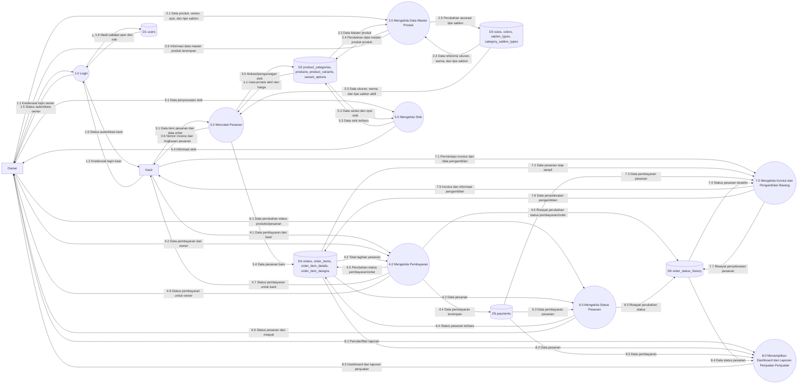
```mermaid
flowchart LR
    Owner[Owner]
    Kasir[Kasir]

    P1((1.0 Login))
    P2((2.0 Mengelola Data Master Produk))
    P3((3.0 Mencatat Pesanan))
    P4((4.0 Mengelola Pembayaran))
    P5((5.0 Mengelola Stok))
    P6((6.0 Mengelola Status Pesanan))
    P7((7.0 Mengelola Invoice dan Pengambilan Barang))
    P8((8.0 Menampilkan Dashboard dan Laporan Penjualan Penjualan))

    D1[(D1 users)]
    D2[(D2 product_categories, products, product_variants, variant_options)]
    D3[(D3 sizes, colors, sablon_types, category_sablon_types)]
    D4[(D4 orders, order_items, order_item_details, order_item_designs)]
    D5[(D5 payments)]
    D6[(D6 order_status_history)]

    Owner -->|1.1 Kredensial login owner| P1
    Kasir -->|1.2 Kredensial login kasir| P1
    P1 -->|1.3 Data user dan role| D1
    D1 -->|1.4 Hasil validasi user dan role| P1
    P1 -->|1.5 Status autentikasi owner| Owner
    P1 -->|1.6 Status autentikasi kasir| Kasir

    Owner -->|2.1 Data produk, varian, opsi, dan tipe sablon| P2
    D2 -->|2.2 Data Master produk| P2
    D3 -->|2.3 Data referensi ukuran, warna, dan tipe sablon| P2
    P2 -->|2.4 Perubahan data master produk produk| D2
    P2 -->|2.5 Perubahan asosiasi tipe sablon| D3
    P2 -->|2.6 Informasi data master produk tersimpan| Owner

    Kasir -->|3.1 Data item pesanan dan data order| P3
    D2 -->|3.2 Data produk aktif dan harga| P3
    D3 -->|3.3 Data ukuran, warna, dan tipe sablon aktif| P3
    P3 -->|3.4 Data pesanan baru| D4
    P3 -->|3.5 Alokasi/pengurangan stok| D2
    P3 -->|3.6 Nomor invoice dan ringkasan pesanan| Kasir

    Kasir -->|4.1 Data pembayaran dari kasir| P4
    Owner -->|4.2 Data pembayaran dari owner| P4
    D4 -->|4.3 Total tagihan pesanan| P4
    P4 -->|4.4 Data pembayaran tersimpan| D5
    P4 -->|4.5 Perubahan status pembayaran/order| D4
    P4 -->|4.6 Riwayat perubahan status pembayaran/order| D6
    P4 -->|4.7 Status pembayaran untuk kasir| Kasir
    P4 -->|4.8 Status pembayaran untuk owner| Owner

    Owner -->|5.1 Data penyesuaian stok| P5
    D2 -->|5.2 Data varian dan opsi stok| P5
    P5 -->|5.3 Data stok terbaru| D2
    P5 -->|5.4 Informasi stok| Owner

    Owner -->|6.1 Data perubahan status produksi/pesanan| P6
    D4 -->|6.2 Data pesanan| P6
    D5 -->|6.3 Data pembayaran pesanan| P6
    P6 -->|6.4 Status pesanan terbaru| D4
    P6 -->|6.5 Riwayat perubahan status| D6
    P6 -->|6.6 Status pesanan dan riwayat| Owner

    Kasir -->|7.1 Permintaan invoice dan data pengambilan| P7
    D4 -->|7.2 Data pesanan siap tampil| P7
    D5 -->|7.3 Data pembayaran pesanan| P7
    D6 -->|7.4 Status pesanan terakhir| P7
    P7 -->|7.5 Invoice dan informasi pengambilan| Kasir
    P7 -->|7.6 Data penyelesaian pengambilan| D4
    P7 -->|7.7 Riwayat penyelesaian pesanan| D6

    Owner -->|8.1 Periode/filter laporan| P8
    D4 -->|8.2 Data pesanan| P8
    D5 -->|8.3 Data pembayaran| P8
    D6 -->|8.4 Data status pesanan| P8
    P8 -->|8.5 Dashboard dan laporan penjualan| Owner
```
