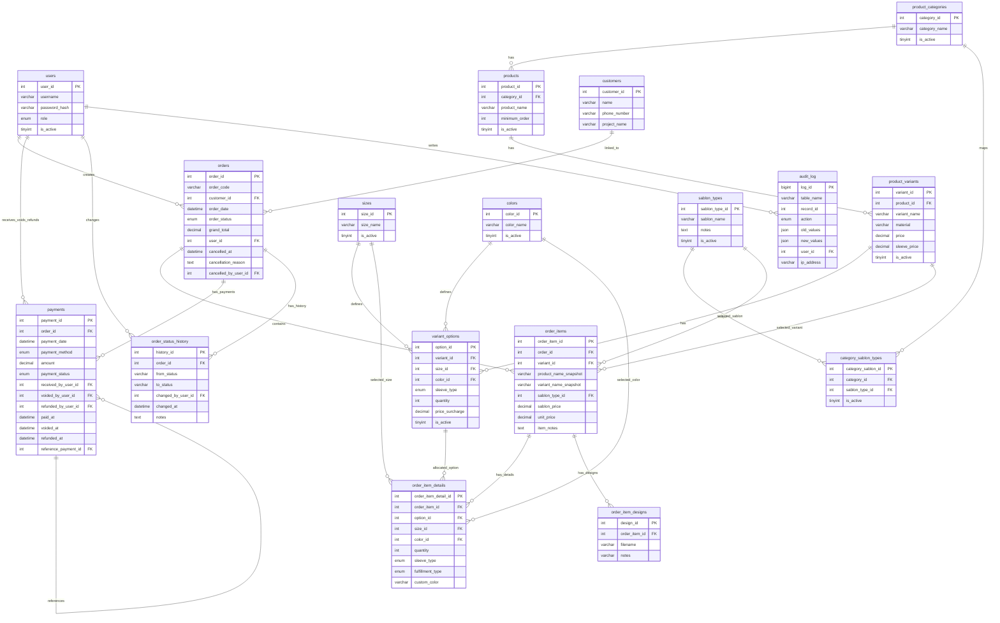
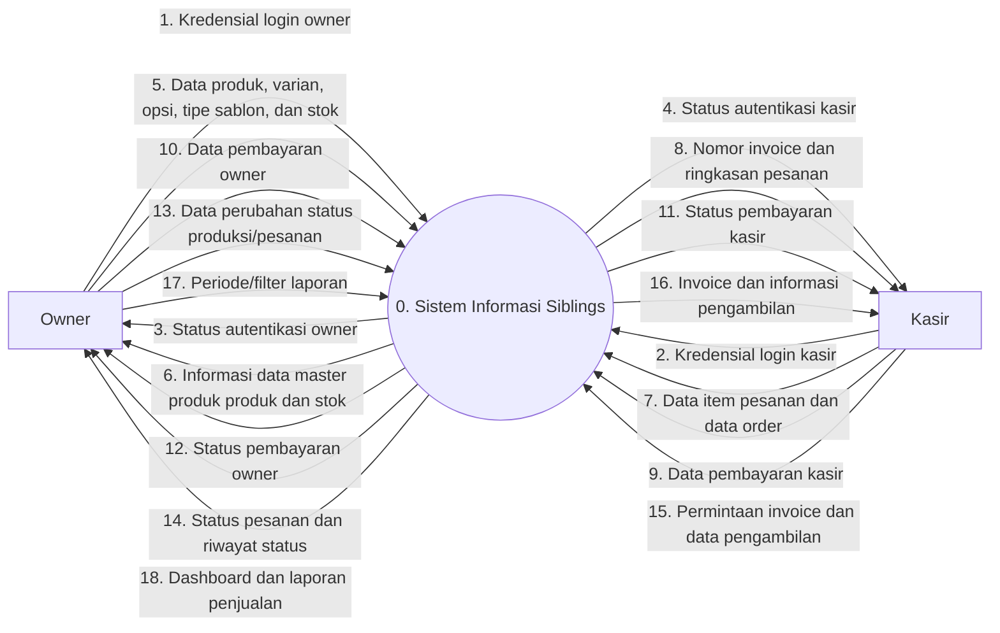
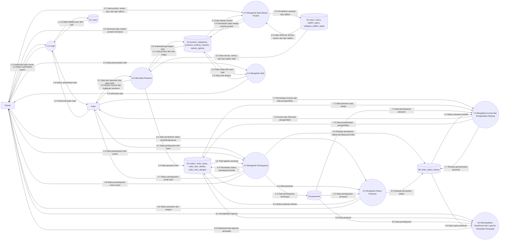

### Sequence Diagram

| No | Judul | Aktor |
|----|-------|-------|
| 1 | [Membuat Pesanan](#1-membuat-pesanan) | Kasir |
| 2 | [Menyimpan Pesanan](#2-menyimpan-pesanan) | Kasir |
| 3 | [Mencatat Pembayaran (Kasir)](#3-mencatat-pembayaran-kasir) | Kasir |
| 4 | [Melihat / Cetak Invoice](#4-melihatcetak-invoice) | Kasir |
| 5 | [Memproses Pengambilan Barang](#5-memproses-pengambilan-barang) | Kasir |
| 6 | [Mengelola Produk](#6-mengelola-produk) | Owner |
| 7 | [Mengelola Varian Produk](#7-mengelola-varian-produk) | Owner |
| 8 | [Mengelola Opsi Varian](#8-mengelola-opsi-varian) | Owner |
| 9 | [Mengelola Tipe Sablon](#9-mengelola-tipe-sablon) | Owner |
| 10 | [Mengelola Stok](#10-mengelola-stok) | Owner |
| 11 | [Mengelola Status Produksi / Pesanan](#11-mengelola-status-produksipesanan) | Owner |
| 12 | [Melihat Dashboard / Laporan](#12-melihat-dashboardlaporan) | Owner |
| 13 | [Mencatat Pembayaran (Owner)](#13-mencatat-pembayaran-owner) | Owner |
 
---

### 1. Membuat Pesanan
- [](https://www.plantuml.com/plantuml/png/RPBTQkCm48NlzHH3hbf8Ng0NIpTE2sKt4AZt0SRH99bQ7dcbKM7VViToJVe7lZ3wZkQSW-O-AoOjGt3A6WYUwMyXEH9iO4z3Lr3XG1a5nJayQapm2pCdryKY7jC_M3t6D9Xcc5Khm0n_djmnYgOOODKcb6mtEKepdmLALTKsZiHSRSOXHL-Eke-UGcM7lVEes64cMEtU_YhPRPsh4M3pmupW3hQbHxXWm045nYM8CsQAjZ55cafbXTCKzQemPeh3tXHdqfgX_zahdsvkdPqQsssDFJ_yVcXQ62jVmoicHbb373El8MCNeZWJRfPPKt2pF54YoLmdBK4gcWS1Jaurmr94SHWvzDPY2lgffH6-V0dXIP43iDBmNU4BQv7pZEUs5RzYO6_JWMKiUiMBLowTHiMtkHzpMCWEBz2JVVQqBoZdzyxeVHiRMwcRwUxjUzVCmsZTflFfUgQSRIa-62UMSu_sEf-66vzJt5q1U1ufTPWAktiIRply7m)
 
---
 
### 2. Menyimpan Pesanan
- [](https://www.plantuml.com/plantuml/png/XLF1Rjim3BthAuYSDi3P1_GmD77ImHYS58bx3XY9M8J8aYjH1VBtevLuQu2rkn5yJu_FVFHZOeoSUwVOiYFOqsichmdcq9A_s7v03y-KqADN2ZM723ynsQYE8Nk3yGApfn1xg4-apo7p3331IwDqy1o3WraNqITvQ8Elhpr7iR2wMf6NiPSxKXiCkIlUAeECHqm4izMjAiXggLHn0VFlCWmUO9-FlMKORawb9qXN2vB4Cdq9qL0SDRugwKxO6pfhH0Vg_UwfWaGfYOCAZ7oqzKFcYTmAMKT2fkqez5Uk0Ytxgo0dYeqHyNRahvR2Nwv_D1leTelDVb5tpNRp7cms-_Mk0vt5Nayn_GChCpu43fQf_nmz66Aqxh-aP7_vEzBByshHhMKxqQBdGnZ6NDAtrumbhW_rv9OufyF9ZZk_ezNRjcqw9VLyMkVDWgbkbPRSovCfd9C4u_ua-YurxGZZ51PmEPrpieKotKCaOoDfbXZVWjLKBaB0wzKy06C_M7SkELy9Z-ID_0U_0G)
 
---
 
### 3. Mencatat Pembayaran Kasir
- [](https://www.plantuml.com/plantuml/png/ZLB1Ri8m3BtdAonE834-WCC4jDrKRIs8XZDocmWYqgHBqadz-vcMJaNQOQSaVi_FptOsFg0BRQrPK45BAEHNAqqbuGKoEZ5WW8EiI-pGeO4FzCenXbMmxl4eRMi4kWvciGoeDD4z6ZGpG0-db5NM16Srp3W9UCfKraH3J4lNitZ4fA7wtHCfiqBg0S-O82SbUabL7hSUYNUCzJRWvPMAmHfIqxG1cb_BZAA4yOWm9olhn06xcihDwIfTAfRG386xy88HSQH_erQ2n24gZcyWg7rZQsLGZwJiNvfBkDqTfeB4itjUlAEyNVAUvi2FsxpOHZpTvrCmpOlao4SHFuMAv3E9E1IdR3x2Awnf1s7n1wtturSN6eGu1nl8E-hfUA2MfD5U5GIyg2lD2s0YSph4MvwCClrnfXyJMl_CUnYU4ivNvUcNTBHQCNKMxRCivNra7FIZaRCI_MJ7LJhf6sjevxwzUUdxJH8sx7iDGvbfBq6w4btBDbIIllGF)
 
---
 
### 4. Melihat/Cetak Invoice
- 
 
---
 
### 5. Memproses Pengambilan Barang
- [](https://www.plantuml.com/plantuml/png/TLBBJiCm4BpxArOzWQ1yG2LGcmSewbDDUgwsoIgrOZl1Tf3wzsppW1Q9aotlpEpihEVEe_MjLi9BhmXI-cp9v0HJM9DkREt8mOvCYVea5He8qA8fXS3SrnQMwAGLfxer1TeBJ2BoA1KJ71eq4q07XqJajV6sLZ39cEkOAMiJzc-AR8VAGb6WnnCwOfNXrbMYG8Yk3KpVM0nci5IoWi5QysjDS94XMSYGlDQD8ayxcLTjyr3RWcnIF0ekZf0lLB9WNGZJ_JiKF1hR8QYwYNfS530kY3-I3MJxnIPTX5cotTmMqtWLXnbq-i_Gu4MJyU1QhJaEmP3fs8vpzgthaLstXlG9BzSq1IhcNAyUF5aUgJrB0N3Jvx2B5bdSizrBTnm7nTUVOOjxJh99u_tWRG0VpzBnsYxtm72xNYVPy3Q6xDgAynMaU26ZDywh-i_XVhjQ1Ojm-KUcn18LF04gv2yXo1JTchZSxtG67dKZLSM9dFb5YJbZ-3z-0m)
 
---
 
### 6. Mengelola Produk
- 
 
---
 
### 7. Mengelola Varian Produk
- 
 
---
 
### 8. Mengelola Opsi Varian
- 
 
---
 
### 9. Mengelola Tipe Sablon
- 
 
---
 
### 10. Mengelola Stok
- 
 
---
 
### 11. Mengelola Status Produksi/Pesanan
- [](https://www.plantuml.com/plantuml/png/TPDDRzim38Rl-XL4JXsmhFSUXYQEEnXBui1Mpm5Z4wbWHSeaEaN-_MXRsReYEraW7_BbbvyZO-3-P1KRjWGr_Uh9DGHps90xalKMeMRaFi8k-BRleddSKKI7JYbis0Setnq5TV2zQp5SOROYHcCXKJF02A-5QhpZu2tCT40N9T9ubqqsIs6aTAPQP3nW9CcINgDdjLHgb87vTqa6Jx0prhn1d2exK31Tp-wAIfo2w4oG_YpPQ2h-mOUMGj5-1KVla-cB4kh6Nj2Q5gE1hAvUe4K7KXU17rkRkDLIk6N-ezY2hXRRUf7fejn-TDRvEiyqZ58HNieANdUhXSwLUEStfLHoH6GmpjmjWeSH6NbCi4BBVsqZfG0-24yoIVZR-Dcdq7-uObldLIem0Vit4sM9Lm47bLHTWt83ifT1vvxI6QydSXobPGqNRzh_aXSC1Xtl_NbOU8H0Wno9a6ywYI7tgPUit6mAdMotRKUvEugAh5p6dq6m3AkxDuwgNA-NY-pdfoH7FA9LW-1m96ATBke964zdOpjPUcgVAHmmzEfPOFatVWC)
 
---
 
### 12. Melihat Dashboard/Laporan
- 
 
---
 
### 13. Mencatat Pembayaran Owner
- [](https://www.plantuml.com/plantuml/png/ZL91Ri8m4Bpx5IjE804Fu5018QqYDO28EQCbNe5LnwQsqog_xvAGAaWzz1HdPtPclEjbYEXZNHaHTJG41NtMP4k26UJynOWHzbITiK6F5dRVbhmGM4Rd7pzdLrk5le7HXY9gm_I05kq8CC0n4wMpqJi38ya2WJkriqbNC-HRbam4MVPldaYvKsGwF1UAavmn4BiyJYsoMGlHne3P2vl10Z9xgoFSVYCBhZ8c4yOybSwhFJOLsutvI3vJKxXrXRlmH32nft-XqGg3XgGul4w10nEukzaKhAkqHTEpyt-9JxlkJB5BVk_RhBbldRvbMv27rRPO9JBRROTWjYtIW-n5mX0gqlSqaL0Syt4Fpx7YPSJ97xGsJvXVU2Bg55tax6Y6SuAAMAE-QeXuqLSU7C10vhZVh6JQoxIV4p-TM8TdtYFma72wwi3FfU4Tgs6oP9VdcMmh_SGV5pbfrKwstwcdS7EMbn_gZq2XNIbZtU8NqDaCxnB9dz7NOicM_BP_00)
 
---

### Q. Domain Class Diagram
- [Class Diagram](https://www.plantuml.com/plantuml/uml/lLTDSnit3BtdL-pufAPsFguzHR5d6iyqZYToSeUMq2uYBgcIe3rkf_-zecXnfGLPsvEfJ_RYuH5u80bGJVF1CpWEWtxLD0qJQspEDNZVN11q3ePcGPvnQ2xDohe1F6qDIqscywyYmw_9R23wjP4rPtQq38oNhJKB-WkRTz4jWSqtZwxvEtutpLaJFBfBrVosNPgnGtTeDp3W5bcmsqRQ0nlm_iuwzGbyBq1djMIGdxTCjn7uQAr6C0dvjO70FHgc5XXd-uKp_nT9wC5_tHfcCSvLpaxw_dEWzzfP5Le-1yREkljHUljWASZFM0xoH47H7iN4V6ujgJsWK4BbFCVyDiaWqyjGCRk130rX-E8KEidygTm553OA63yVH9pz6S0myVqO-X71ty4Hc0FTjyaWTMUeh1iOjwWMmCPH6zqliAK1zDxiDU8jNfV1UfbQq6tGmFWHV6B7gepydpy83mNvic6oPYoBtNsBgcGbD_SRMHIv6qTLMGJNzk2wPrK0r8_WUS6sNTTtEmicl_EStm9fM6eiKsgNDtQliGH--oKBaEmlU5FFhRRke8_4psbQ6NZ1l1QmrDR4St1GicmJ6MQqcAAnZFw54j_tvfA0zWWJ8lw_d89dE-3XFYTBSQlBexAt1g_2i4GdCMT_OAc3vwvwxUoADCwEbZujBdfQNAwcB4s6BCiw9JLbuDmg8ImX5y0HYNzkQC0ZRC70mGjUvy2e6ykWPRzfmRIeDQevYrKp2h45VaNmrkJ5HMF-FKSHdJaNDoKuCtWtINLwKbBWcJkEAPlSDP2QLHfPBlebup0fV3GzCk4N1ZQ-jvoZosbOySatl3BbWY6kGCGuNEKMKApp8YnPLBac-m8PI4_5Pq2Me3ox7Xrugw1NfFM0XYMUBt7gu5LbAQUihr2cfqdsr9bHijfzbvJ6UsxgJRZS7zBoCy4zdR2gpo-u7z0SlZUJGIQOeUALp-XdvDugeG466moFzPgmYgqYebJk154AbY67gs0ac8esW5l7IofcGVp_eHO2IokMKB7ZISSdydpq8wDFXkAkEpjKrBEj06qFfYieh1yMXwrrwdp7cnL2dkPWppv1yw28_x3Tg5RRhgIKOQdB3xIKNOa3RUprWc2r-Wuwe2oDmRiAGfkvKWwzBCwT8yQjWbcELb4iVaMUl3zfpiwQatTlthm-sQDRre03QLhJ0MVd-reufsT-v30wHOuQ1IxpieEW7_qyc4ICp-MSMjbTKHSChC4qLcCVIQaPFeVrU4LAJxgOgkc0Wulq4NWAKz46UHT_0mfY_Fn0EwQdopWfopV_NsxB09oz8bnr10QzpI66J_PnRzwFph7tRmbBTEIB-ob3P5OKIfhwQOMgbBmtEQ-C57FB4tTIekCDb_44MH5ekmPFCR0uUaLILfTFNJsGu9J42LeUkgEuJ9jGylmxSitMd9XqTxX2XyRJg-hQSYAaqzy2by-QJCcWem7U7XoxjsaQrUcrg5rOGb-bvJQUd8CclnFs0OqAW_uN)

### R. ERD

### S. DFD Level 0

### T. DFD Level 1

